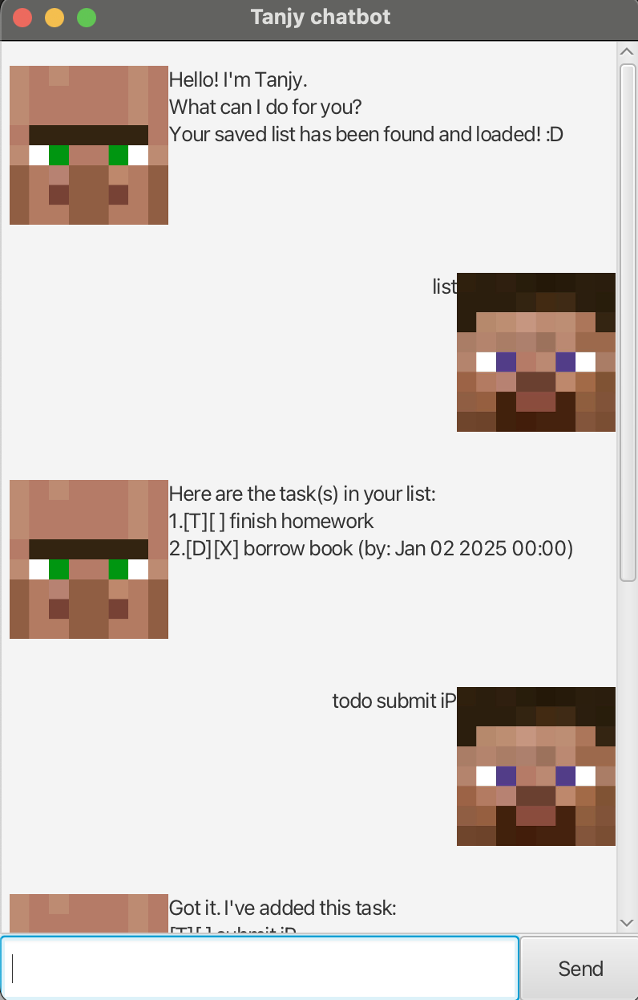

# Tanjy User Guide



Tanjy is a Duke-style chatbot designed to manage tasks, 
deadlines, events, and more. 
It integrates with a user-friendly GUI for seamless interaction. 
Users can add tasks, mark, find and snooze them with ease.

## Adding Tasks

### Todo task

To add a simple task with no time frame, use the `todo` command followed by the
task description.

Example: `todo borrow book`

The task type and mark status will be shown. The task type for todo tasks is  `T`
and the mark status is unmarked by default, indicated by `[]` after the task type.

```
Got it. I've added this task:
[T][] borrow book
Now you have 1 task(s) in your list.
```

### Deadline Task

To add a task with a deadline, use the `deadline` command followed by the
description of the task. After the description, use the `/by` command to add the deadline.
The format should be: `YYYY-MM-DD HHmm` The exact hour and minute is optional.

The task type is `D` and it is also unmarked by default.

Example: `deadline borrow book /by 2026-02-01 1000`

Additionally, the task type and mark status will be shown. The task type for todo tasks is  `D`
and the mark status is unmarked by default, indicated by `[]` after the task type.

```
Got it. I've added this task:
[D][] borrow book (by: Feb 01 2026 10:00)
Now you have 1 task(s) in your list.
```

### Adding Event Tasks

To add a task that occurs within a time frame, use the `event` command followed by the
task description. After that, use the `/from` command to indicate the start date of the
event, followed by the `/to` command to indicate the end date.

The task type is `E` and it is also unmarked by default.

Example: `event borrow book /from 2026-02-01 1000 /to 2026-02-01 1400`

Additionally, the task type and mark status will be shown. The task type for todo tasks is  `E`
and the mark status is unmarked by default, indicated by `[]` after the task type.

```
Got it. I've added this task:
[E][] borrow book (from: Feb 01 2026 10:00 to: Feb 01 2026 14:00)
Now you have 1 task(s) in your list.
```

## Marking and Unmarking Tasks

To mark tasks as done or undone, use the `mark` and `unmark` commands respectively, followed
by the index of the task you want to mark/unmark.

Example: `mark 1` or `unmark 1`

If marking, the task will be marked, as indicated by the `[X]` after the task type.
If unmarking, the task will be unmarked, as indicated by the `[]` after the task type.

```
Got it. I've marked this task as done:
[T][X] finish homework
```

## Listing all tasks

To see the list of tasks, use the `list` command and all tasks will be listed.

Example: `list`

All tasks will be listed, with their corresponding indexes, task types, mark status
and descriptions.

```
Here are the task(s) in your list:
1.[T][] finish homework
2.[D][X] borrow book (by Feb 01 2026)
3.[E][] attend seminar (from: Feb 02 2026 10:00 to: Feb 02 2026 14:00)
```

## Deleting tasks

To delete a task, use the `delete` command followed by the index of the task you want to delete.

Example: `delete 1`

The task that you deleted will be shown, followed by the updated number of tasks.

```
Got it. I've removed this task:
[T][] borrow book
Now you have 0 task(s) in your list.
```

## Finding tasks

To find a task, use the `find` command followed by any keyword used in the task description
you wish to find.

Example: `find book`

The tasks that have the keyword in their description will be shown, regardless of task type.

```
Here are the matching tasks in your list:
1.[T][] borrow book
2.[D][] return book (by: Feb 01 2026 10:00)
```

## Saving your list

To save the list, use the `save` command to save the list onto your hard drive.
The next time you boot up the Tanjy chatbot, the list can be accessed again.

Example: `save`

The entire task list will be saved locally and can be accessed the next time you use the chatbot.

```
Your list has been saved successfully!
```

## Exiting the Chatbot

To exit, use the `bye` command to close the chatbot. The window will be closed after the command is entered.

Example: `bye`

```
//nothing will be shown, the window will be closed
```

## Snooze Feature

The `snooze` feature allows you to postpone a task until a later time. 
You can set a custom snooze duration by using the specific command based on the task type.

Example: `snooze 1 /by 2026-01-01`

```
Ok! I've snoozed that deadline.
[D][X] borrow book (by: Jan 01 2026 00:00)
```